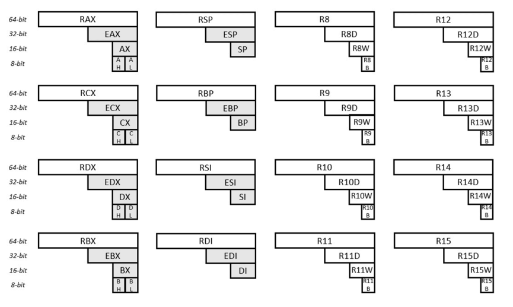

В открытых источниках вы скорее всего найдете AT&T. Мы допускаем сдачу ДЗ на нем, но все семинары и лекции будут проводится на Intel ассемблере. Чтобы ассемблерный файл работал на интеле нужно в начало написать ```.intel_syntax noprefix```

## Компиляция и запуск

#### Компилируем
```gcc <file_name> -o <bin_name>```

```gcc add_two.S simpleio_i686.S -o add_two```

#### Запускаем
```./add_two```

#### Генерируем asm
```gcc -S -masm=intel file.c```

# ASM
## Регистры

На 32 битной архитектуре есть 8 регистров общего назначения:

eax, ebx, ecx, edx, esi, edi, ebp, esp

ebp, esp - используются для перемещения по стеку.

На 64 битной архитектуре, регистров общего назначения 16:

RAX, RBX, RCX, RDX, RSI, RDI, RBP, RSP, R8, R9, R10, R11, R12, R13, R14 и R15

Но есть можно их использовать и как 32битные регистры:



Кроме регистров общего назначения есть еще два:

RFLAGS - регистр флагов

RIP - указатель адреса следующей инструкции для выполнения

## Флаги

Большинство арифметических инструкций в результате вычисления результата инструкции устанавливают арифметические флаги слова состояния процесса.

Флаг ZF устанавливается, если в результате операции был получен нуль.

Флаг SF устанавливается, если в результате операции было получено отрицательное число.

Флаг CF устанавливается, если в результате выполнения операции произошел перенос из старшего бита результата. Например, для сложения CF устанавливается если результат сложения двух беззнаковых чисел не может быть представлен 32-битным беззнаковым числом.

Флаг OF устанавливается, если в результате выполняния операции произошло переполнение знакового результата. Например, при сложении OF устанавливается, если результат сложения двух знаковых чисел не может быть представлен 32-битным знаковым числом.

Обратите внимание, что и сложение addl, и вычитание subl устанавливают одновременно и флаг CF, и флаг OF. Сложение и вычитание знаковых и беззнаковых чисел выполняется совершенно одинаково, и поэтому используется одна инструкция и для знаковой, и для беззнаковой операции.

## Переходы
```
    jz      label   /* переход, если равно (нуль), ZF == 1 */
    jnz     label   /* переход, если не равно (не нуль), ZF == 0 */
    jc      label   /* переход, если CF == 1 */
    jnc     label   /* переход, если CF == 0 */
    jo      label   /* переход, если OF == 1 */
    jno     label   /* переход, если OF == 0 */
    jg      label   /* переход, если больше для знаковых чисел */
    jge     label   /* переход, если >= для знаковых чисел */
    jl      label   /* переход, если < для знаковых чисел */
    jle     label   /* переход, если <= для знаковых чисел */
    ja      label   /* переход, если > для беззнаковых чисел */
    jae     label   /* переход, если >= (беззнаковый) */
    jb      label   /* переход, если < (беззнаковый) */
    jbe     label   /* переход, если <= (беззнаковый) */
```

## Инструкции
#### В Intel порядок DST, SRC обратен AT&T
```
add    DST, SRC        /* DST += SRC */
sub    DST, SRC        /* DST -= SRC */
inc    DST             /* ++DST */
dec    DST             /* --DST */
neg    DST             /* DST = -DST */
mov    DST, SRC        /* DST = SRC */
imul   SRC             /* (%eax,%edx) = %eax * SRC - знаковое */
mul    SRC             /* (%eax,%edx) = %eax * SRC - беззнаковое */
and    DST, SRC        /* DST &= SRC */
or     DST, SRC        /* DST |= SRC */
xor    DST, SRC        /* DST ^= SRC */
not    DST             /* DST = ~DST */
cmp    DST, SRC        /* DST - SRC, результат не сохраняется, */
test   DST, SRC        /* DST & SRC, результат не сохраняется  */
adc    DST, SRC        /* DST += SRC + CF */
sbb    DST, SRC        /* DST -= SRC - CF */
```

## simpleio

readi32 - считать 32 битное число (сложится в eax)

readi64 - считать 64 битное число (сложится в rax)

writei32 - напечатать 32 битное число (печатается из edi)

writei64 - напечатать 64 битное число (печатается из rdi)

Не меняет значени регистров rsp, rbp, rbx, r12, r13, r14, r15.

Если ввод закончен, что флаг CF выставится в 1. Проверить по jc.

Чтобы закончить ввод нужно нажать CTRL+D или произвести ввод из файла cat file.txt | ./a.out или через echo "1 2 3" | ./a.out

## GDB:

### Компиляция:

Нужно компилировать с отладочными символами, добавив `-g`

`gcc -g add_two.S simpleio_i686.S -o add_two`

### Запуск:

`gdb ./add_two`

### Команды:
    set disassembly-flavor intel - чтобы смотреть на интел синтаксис 
    list (l)- показать код.
    break (b)- установить брейкпоинт. Нужно указать имя функции или строку. b main. Выполнение дойдет до этого места и остановится.
    run (r) - запустить программу
    info break (i b) - посмотреть брейкпоинты
    del (d) <breakpoint num> - удалить брейкпоинт с номером breakpoint_num
    layout regs (la reg) - включить просмотр регистров
    step (s) - сделать шаг исполнения (с заходом в функции)
    next (n) - сделать шаг исполнения (без захода в функции)
    continue (c) - продолжить выполнение до следующего брейкпоинта
    refresh - обновить отображение (если все съехало или перекособочилось)
    finish - выйти из функции
    help <command> - справка по команде

    p/t $eax - напечатать регистр eax бинарно
    p/z $eax - напечатать регистр eax 16-рично
    set $eax=5 - установить значение $eax равное 5
    jump main - продолжить выполнение с другого места (не обязательно main, можно указать любое другое место или номер строки)
    p/t $eax^3 - напечатать в бинарном виде рузультат выполнения команды $eax XOR 3 (другие логические операции тоже можно использовать)
    ctrl+x a - переключиться между панелями
