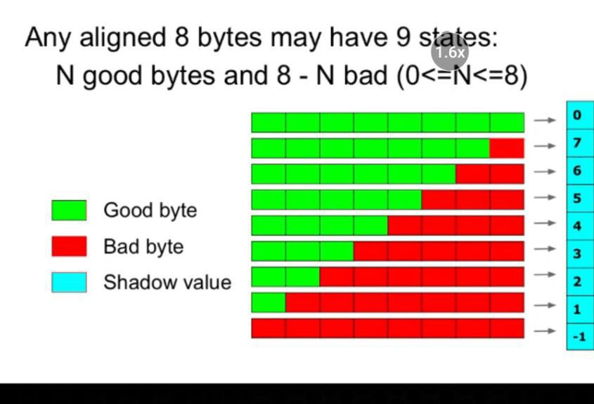
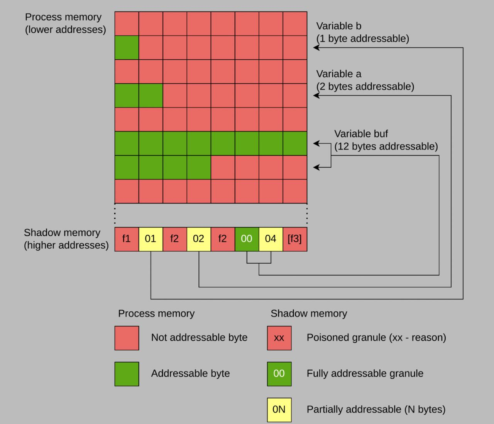
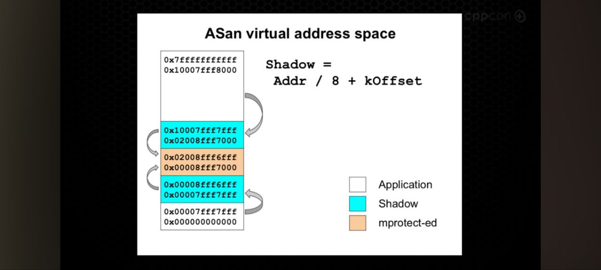

# ASAN shadow bytes

Все данные у нас аллоцированны с памятью выровненной по 8 байт. А значит, у нас есть всего 9 состояний памяти. Каждый shadow-byte представляет собой информацию о 8 байтах:



```
int main() {
    short buf[6], a=0;
    char b=1;
    // trigger out-of-bounds so ASan shows
    // shadow bytes around the buggy access
    buf[10] = a+b;
}
```



Маппинг происходит простой функцией:
```
shadow_address = (address >> 3) + kOffset;
```

Вот так выглядит адресное пространство:


# MSAN

1-to-1 bit representation.
Не каждая неинициализированная переменная - баг.
Пример - падинги в структурах.

Интересность тут - tracking origins.

```
a = malloc()
b = malloc()
c = *a + *b
if (c)
```

Кто виноват? 'a' или 'b'? Чтобы определить, msan с флагом сохраняет откуда мы получили память.
```
clang++ -g msan_origin.cpp -fsanitize=memory -fsanitize-memory-track-origins=2
```

# TSAN

Очень схожая идея с ASAN, только мы для каждого потока делаем и в синхронизирующие сисколы добавляем гадости.
Размер гораздо больше получается.

Каждый поток имеет свой вектор, который отслеживает порядок событий.

При доступе к памяти TSAN сравнивает векторные часы текущего потока с теми, что хранятся в shadow memory.

Если обнаруживается, что два потока обращались к одной памяти без синхронизации (и хотя бы одна операция — запись), это считается гонкой.

# UBSAN

Самый скучный - просто тупые проверки в рантайме. UB строго определено в стандарте - вставляем проверки.
